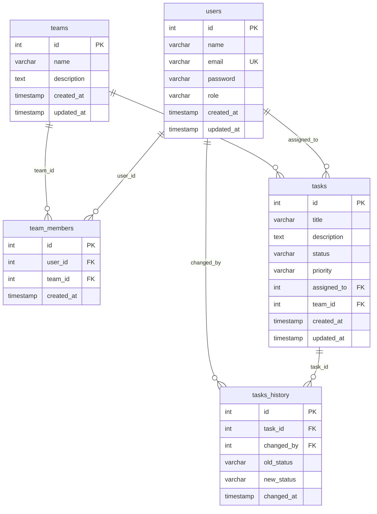

# Diagrama ER (schema Prisma)

Renderiza automaticamente no **GitHub** / **GitLab** ao visualizar este arquivo (Mermaid nativo no Markdown).

> **Limite:** sites como [mermaid.live](https://mermaid.live) podem restringir uso; arquivos `.md` no repositório **não** têm limite de diagramas. Alternativas gratuitas locais: VS Code + extensão Mermaid, Obsidian.

